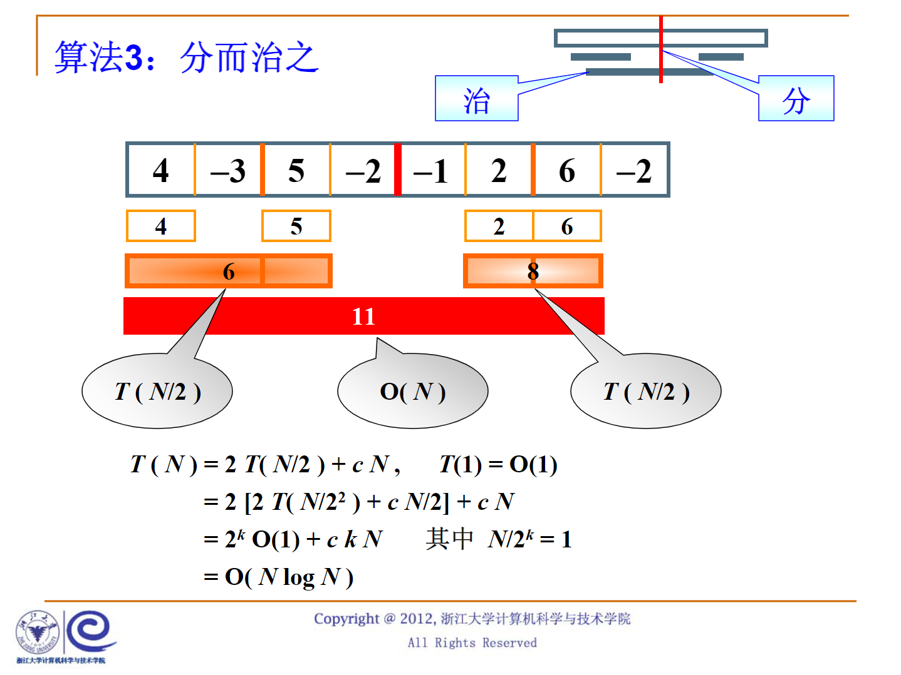
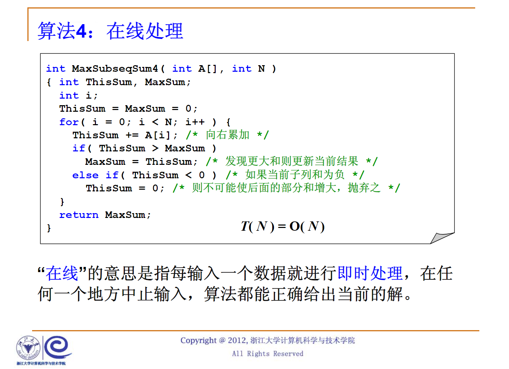

## 1.3.1应用实例-算法1&2
最大子列和问题:
给定 $N$个整数的序列 $\{A_1,A_2,\cdots,A_N\}$，求函数 $f(i,j)=max{,\sum_{k=i}^jA_k}$
#### 算法1
```C
#include <stdio.h>

int MaxSubseqSum1(int A[],int N)
{
    int ThisSum,MaxSum=0;
    int  i,j,k;
    for(i=0;i<N;I++)/* i是子列左端位置 */
    {
        for(j=i;j<N;j++)/* j是子列右端位置 */
        {
            ThisSum=0;/* ThisSum是从A[i]到A[j]的子列和 */
            for(k=i;k<=j;k++)
            {
                ThisSum+=A[k];
            }
            if(ThisSum>MaxSum)/* 如果刚得到的这个子列和更大 */
            {
                MaxSum=ThisSum;/* 则更新结果 */
            }
        }

    }/* i循环结束 */
    return MaxSum;
}
```
复杂度 $O(n^3)$
#### 算法2
```C
int MaxSubseqSum2(int A[],int N)
{
    int ThisSum,MaxSum=0;
    int  i,j,k;
    for(i=0;i<N;I++)/* i是子列左端位置 */
    {
        ThisSum=0;/* ThisSum是从A[i]到A[j]的子列和 */
        for(j=i;j<N;j++)/* j是子列右端位置 */
        {
            ThisSum+=A[j];
            /* 对于相同的i，不同的j，只需要在j-1次循环的基础上累加一项即可 */
            if(ThisSum>MaxSum)/* 如果刚得到的这个子列和更大 */
            {
                MaxSum=ThisSum;/* 则更新结果 */
            }
        }/* j循环结束 */
    }/* i循环结束 */
    return MaxSum;
}
```
复杂度： $O(n^2)$
## 1.3.2应用实例-算法3
#### 算法3：分而治之
$$O(N)+O(NlogN)=O(NlogN)$$

## 1.3.3应用实例-算法4
#### 算法4：在线处理
```C
int MaxSubseqSum4(int A[],int N)
{
    int ThisSum,MaxSum;
    int i;
    ThisSum=MaxSum=0;
    for(i=0;i<N;i++)
    {
        ThisSum+=A[i];/* 向右累加 */
        if(ThisSum>MaxSum)
        {
            MaxSum=ThisSum;/* 发现更大的更新当前的结果 */
        }
        else if (ThisSum<0)/* 如果当前子列和为负 */
        {
            ThisSum=0;/* 则不可能使后面的部分和增大，抛弃之 */
        }
        
    }
}
```
$$T(n)=O(n)$$

