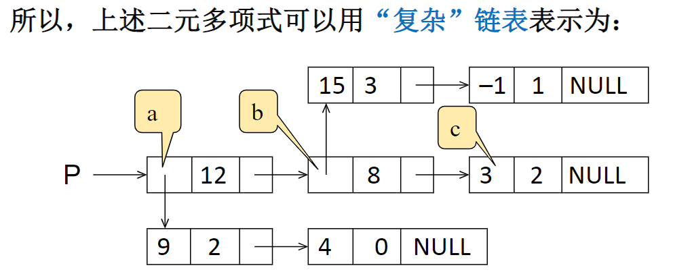
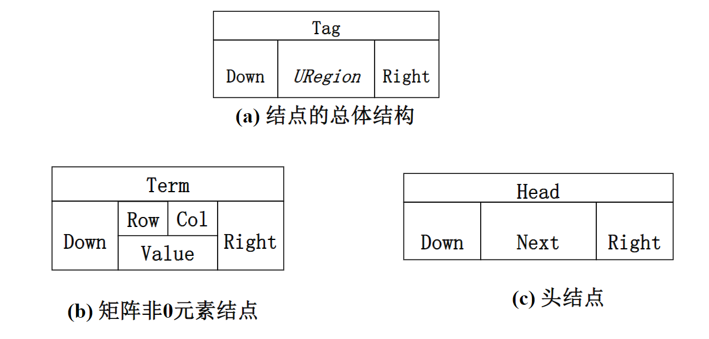

## 2.1.1引子：多项式表示
线性表及其实现
例：一元多项式及其运算
一元多项式： $f(x)=a_0+a_1x+\cdots+a_{n-1}x^{n-1}+a_nx^n$

**分析：如何表示多项式？**

多项式的关键数据：
1. 多项式的项数 $n$
2. 各项系数 $a_i$及指数 $i$

#### 方法1：顺序存储的直接表示

数组各分量对应多项式各项：

$a[i]$:项 $x^i$的系数 $a_i$

例如： $f(x)=4x^5-3x^2+1$

$a[0]=1,a[2]=-3,a[5]=4$

其余位数均为0

两个多项式相加：两个数组对应分量相加

问题：如何表示 $x+3x^{2000}$

#### 方法2：顺序存储结构表示非零项

每个非零项 $a_ix^i$涉及两个信息：系数 $a_i$和指数 $i$

可以将一个多项式看成是一个 $(a_i,i)$的二元组的集合

**用结构数组表示**：数组分量是由系数 $a_i$和指数 $i$组成的结构，对应一个非零项

例如： $P_1(x)=9x^{12}+15x^8+3x^2$

| $下标i$   | 0   | 1   | 2   | ... |
| ------- | --- | --- | --- | --- |
| 系数 $a_i$ | 9   | 15  | 3   |     |
| $指数i$   | 12  | 8   | 2   |     |

**按指数大小有序存储！**

相加过程：从头开始，比较两个多项式当前对应项的指数

#### 方法3：链表结构存储非零项
链表中每个结点存储多项式中的一个非零项，包括系数和指数两个数据域以及一个指针域
```C
typedef struct PolyNode *Polynomial;
struct PolyNode
{
    int coef;
    int expon;
    Polynomial link;
}
```
## 2.1.2线性表及顺序存储
**什么是线性表**
多项式表示问题的启示：
1. 同一个问题可以有不同的表示（存储）方法
2. 有一类共性问题：有序线性序列的组织和管理

**线性表（Linear List）**：由同类型**数据元素**构成**有序序列**的线性结构
1. 表中元素个数称为线性表的**长度**
2. 线性表没有元素时，称为**空表**
3. 表起始位置称**表头**，表结束位置称**表尾**

线性表的抽象数据类型描述

**类型名称**：线性表（`List`）

**数据对象集**：线性表是 $n(≥0)$个元素构成的有序序列 $(a_1,a_2 \cdots a_n)$

**操作集**：线性表 $L\in List$，整数i表示位置，元素 $X\in ElementType$

线性表的主要操作有：
1. `List MakeEmpty()`：初始化一个空线性表L
2. `ElementType FindKth(int K,List L)`：根据位序K，返回相应元素
3. `int Find(ElementType X,List L)`：在线性表中查找X的第一次出现的位置
4. `void Insert(ElementType X,int i,List L)`：在位序i前插入一个新元素X
5. `void Delete(int i,List L)`：删除指定位序i的元素
6. `int Length(List L)`：返回线性表L的长度n

**线性表的顺序存储实现**

利用数组的连续存储空间顺序存放线性表的各元素
```C
typedef struct LNode *List;
struct LNode
{
    ElementType Data[MAXSIZE];
    int Last;
};
struct LNode L;
List PtrL;


/* 1.初始化（建立空的顺序表） */
List MakeEmpty()
{
    List PtrL;
    PtrL=(List)malloc(sizeof(struct LNode));
    PtrL->Last=-1;
    return PtrL；
}

/* 2.查找 */
int Find(ElemntType X,List L)
{
    int i=0;
    while(i<=PtrL->Last&&PtrL->Data[i]!=X)
        i++;
    if(i>PtrL->Last)
        return -1;
    else
        return i;
}//时间复杂度O（n）,平均查找次数（n+1）/2

/*访问下标为i的元素：L.Data[i]或Ptrl->Data[i]
  线性表的长度：L.Last+1或Ptrl->Last+1*/

/*注意指针访问结构体要用->*/

/*主要操作的实现*/
```
## 2.1.3顺序存储的插入和删除
```C
/* 3.插入（第i个位置上插入一个值为X的新元素，下标为i-1） */
void Insert(ElementType X,int i,List PtrL)
{
    int j;
    if(PtrL->Last==MAXSIZE)/* 表空间已满，无法插入 */
    {
        printf("表满");
        return ;
    }
    if(i<1||i>PtrL->Last+2)/* 检查插入位置的合法性 */
    {
        printf("不合法");
        return ;
    }
    for(j=PtrL->Last;j>=i-1;j--)
    {
        PtrL->Data[j+1]=PtrL->Data[j];/* 将ai-an往后挪 */
    }
    PtrL->Data[i-1]=X;/* 新元素插入 */
    PtrL->Last++;/* Last仍指向最后元素 */
    return ;
}/* 平均移动次数n/2，平均时间性能O（n） */

/* 4.删除（删除表的第i个位置上的元素） */
void Delete(int i,List PtrL)
{
    int j;
    if(i<1||i>PtrL->Last+1)
    {
        printf("不存在第%d个元素",i);
        return ;
    }
    for(j=i;j<=PtrL->Last;j++)
    {
        PtrL->Data[j-1]=PtrL->Data[j];/*从左到右操作*/
    }
    PtrL->Last--;
    return ;
}
```
## 2.1.4链式存储及查找
线性表的链式存储实现

**不要求逻辑上相邻的两个元素物理上也相邻**；通过“链”建立起数据元素之间的逻辑关系

插入、删除不需要移动数据元素，只需要修改“链”
```C
typedef struct LNode *List;
struct LNode
{
    ElementType Data;
    List next;
};

struct Lnode L;
List Ptrl;

/* 主要操作的实现 */
/* 1.求表长 */
int Length(List Ptrl)
{
    List p=Ptrl;/* p指向表的第一个结点 */
    int j=0;
    while(p)
    {
        p=p->next;
        j++;/* 当前p指向的是第j个结点 */
    }
    return j;
}

/* 2.查找 */
/* (1)按序号查找：FindKth */
List FindKth(int K,List Ptrl)
{
    List p=Ptrl;
    int i=1;
    while(p!=NULL&&i<k)
    {
        p=p->next;
        i++;
    }
    if(i==K)
        return p;/* if find number k,return pointer */
    else 
        return NULL;/* else return NULL */
}
/* (2)按值查找：Find */
List Find(ElementType X,List Ptrl)
{
    List p=Ptrl;
    while(p!=NULL&&p->Data!=X)
    {
        p=p->next;
    }
    return p;
}
```
## 2.1.5链式存储的插入和删除
```C
/* 3.插入（在第i-1个结点后插入一个值为X的新结点） */
/* （1）构造新结点，用s指向 */
/* （2）再找到链表的第i-1个结点，用p指向 */
/* （3）然后修改指针，插入结点（p之后插入新结点是s） */

List Insert(ElementType X,int i,List PtrL)
{
    List p,s;
    if(i==1)/* 新结点插入在表头 */
    {
        s=(List)malloc(sizeof(struct LNode));/* 申请、填装结点 */
        s->Data=X;
        s->next=PtrL;
        return s;/* 返回新表头指针 */
    }
    p=FindKth(i-1,PtrL);/* 查找第i-1个结点 */
    if(p==NULL)/* 第i-1个结点不存在，不能插入 */
    {
        printf("wrong i");
        return NULL;
    }
    else
    {
        s=(List)malloc(sizeof(struct LNode));/* 申请、填装结点 */
        s->Data=X;
        s->next=p->next;/* 新结点插入在第i-1个结点的后面 */
        p->next=s;
        return PtrL;
    }/* p指向第i-1个结点，s指向要插入的结点 */
}

/* 4.删除（删除链表的第i个位置上的结点） */
/* （1）先找到链表的第i-1个结点，用p指向 */
/* （2）再用指针s指向要被删除的结点（p的下一个结点） */
/* （3）然后再修改指针，删除s所指结点 */
/* （4）释放s所指结点的空间 */

List Delete(int i,List PtrL)
{
    List p,s;
    if(i==1)/* 若要删除的是表的第一个结点 */
    {
        s=PtrL;/* s指向第一个结点 */
        if(PtrL!=NULL)/* 从链表中删除 */
        {
            PtrL=PtrL->next;
        }
        else
        {
            return NULL;
        }
        free(s);/* 释放被删除结点 */
        return PtrL;
    }
    p=FindKth(i-1,PtrL)/* 查找第i-1个结点 */
    if(p==NULL)
    {
        printf("第%d个结点不存在",i-1);
        return NULL;
    }
    else if(p->next==NULL)
    {
        printf("第%d个结点不存在",i);
        return NULL;
    }
    else
    {
        s=p->next;/* s指向第i个结点 */
        p->next=s->next;/* 从链表中删除 */
        free(s);/* 释放被删除结点 */
        return PtrL;
    }
}
```
## 2.1.6广义表与多重链表
#### 广义表
例：我们知道了一元多项式的表示，那么二元多项式又该如何表示？

比如给定二元多项式： $p(x,y)=9x^{12}y^2+4x^{12}+15x^8y^3-x^8y+3x^2$

分析：可把上述二元多项式看成关于x的一元多项式

$p(x,y)=(9y^2+4)x^{12}+(15y^3-y)x^8+3x^2$

可以用复杂链表表示

**广义表（Generalized List）**
1. 广义表是**线性表**的推广
2. 对于线性表而言，n个元素都是基本的**单元素**
3. 广义表中，这些元素不仅可以是单元素，也可以是另一个**广义表**

```C
typedef struct GNode *GList;
struct GNode
{
    int Tag;/* 标志域：0表示结点是单元素，1表示结点是广义表 */
    union/* 子表指针域SubList与单元素数据域Data复用，即共用存储空间 */
    {
        ElementType Data;
        GList SubList;
    }URegion;
    GList Next;/* 指向后继结点 */
};
```
#### 多重链表：
链表中的结点可能同时隶属于多个链
1. 多重链表中结点的**指针域会有多个**，如前面例子包含了Next和SubList两个指针域
2. 但包含两个指针域的链表不一定是多重链表，比如**双向链表就不是多重链表**

多重链表具有广泛的用途，基本上如**树、图**这样相对复杂的数据结构都**可以采用多重链表方式进行存储**

例：矩阵可用二维数组表示，但是二维数组有两个缺陷：
1. 一是数组的**大小要事先确定**
2. 对于**稀疏矩阵**，将造成**大量的空间浪费**

分析：采用一种经典的多重链表，**十字链表**来存储稀疏矩阵
* 只存储矩阵非零元素项
	* 结点的数据域：行坐标`Row`，列坐标`Col`，数值`Value`
* 每个结点通过两个指针域，把同行同列串起来
	* 行指针：`Right`向右指针
	* 列指针：`Down`向下指针

用一个标识域`Tag`来区分头结点和非零元素结点

头结点的标识值为`Head`，矩阵非零元素结点的标识值为`Term`

#### 线性表的定义与操作-顺序表
```C
typedef int Position;
typedef struct LNode *List;
struct LNode {
    ElementType Data[MAXSIZE];
    Position Last;
};

/* 初始化 */
List MakeEmpty()
{
    List L;

    L = (List)malloc(sizeof(struct LNode));
    L->Last = -1;

    return L;
}

/* 查找 */
#define ERROR -1

Position Find( List L, ElementType X )
{
    Position i = 0;

    while( i <= L->Last && L->Data[i]!= X )
        i++;
    if ( i > L->Last )  return ERROR; /* 如果没找到，返回错误信息 */
    else  return i;  /* 找到后返回的是存储位置 */
}

/* 插入 */
/*注意:在插入位置参数P上与课程视频有所不同，课程视频中i是序列位序（从1开始），这里P是存储下标位置（从0开始），两者差1*/
bool Insert( List L, ElementType X, Position P ) 
{ /* 在L的指定位置P前插入一个新元素X */
    Position i;

    if ( L->Last == MAXSIZE-1) {
        /* 表空间已满，不能插入 */
        printf("表满"); 
        return false; 
    }  
    if ( P<0 || P>L->Last+1 ) { /* 检查插入位置的合法性 */
        printf("位置不合法");
        return false; 
    } 
    for( i=L->Last; i>=P; i-- )
        L->Data[i+1] = L->Data[i]; /* 将位置P及以后的元素顺序向后移动 */
    L->Data[P] = X;  /* 新元素插入 */
    L->Last++;       /* Last仍指向最后元素 */
    return true; 
} 

/* 删除 */
/*注意:在删除位置参数P上与课程视频有所不同，课程视频中i是序列位序（从1开始），这里P是存储下标位置（从0开始），两者差1*/
bool Delete( List L, Position P )
{ /* 从L中删除指定位置P的元素 */
    Position i;

    if( P<0 || P>L->Last ) { /* 检查空表及删除位置的合法性 */
        printf("位置%d不存在元素", P ); 
        return false; 
    }
    for( i=P+1; i<=L->Last; i++ )
        L->Data[i-1] = L->Data[i]; /* 将位置P+1及以后的元素顺序向前移动 */
    L->Last--; /* Last仍指向最后元素 */
    return true;   
}
```
#### 线性表的定义与操作-链式表
```C
typedef struct LNode *PtrToLNode;
struct LNode {
    ElementType Data;
    PtrToLNode Next;
};
typedef PtrToLNode Position;
typedef PtrToLNode List;

/* 查找 */
#define ERROR NULL

Position Find( List L, ElementType X )
{
    Position p = L; /* p指向L的第1个结点 */

    while ( p && p->Data!=X )
        p = p->Next;

    /* 下列语句可以用 return p; 替换 */
    if ( p )
        return p;
    else
        return ERROR;
}

/* 带头结点的插入 */
/*注意:在插入位置参数P上与课程视频有所不同，课程视频中i是序列位序（从1开始），这里P是链表结点指针，在P之前插入新结点 */
bool Insert( List L, ElementType X, Position P )
{ /* 这里默认L有头结点 */
    Position tmp, pre;

    /* 查找P的前一个结点 */        
    for ( pre=L; pre&&pre->Next!=P; pre=pre->Next ) ;            
    if ( pre==NULL ) { /* P所指的结点不在L中 */
        printf("插入位置参数错误\n");
        return false;
    }
    else { /* 找到了P的前一个结点pre */
        /* 在P前插入新结点 */
        tmp = (Position)malloc(sizeof(struct LNode)); /* 申请、填装结点 */
        tmp->Data = X; 
        tmp->Next = P;
        pre->Next = tmp;
        return true;
    }
}

/* 带头结点的删除 */
/*注意:在删除位置参数P上与课程视频有所不同，课程视频中i是序列位序（从1开始），这里P是拟删除结点指针 */
bool Delete( List L, Position P )
{ /* 这里默认L有头结点 */
    Position pre;

    /* 查找P的前一个结点 */        
    for ( pre=L; pre&&pre->Next!=P; pre=pre->Next ) ;            
    if ( pre==NULL || P==NULL) { /* P所指的结点不在L中 */
        printf("删除位置参数错误\n");
        return false;
    }
    else { /* 找到了P的前一个结点pre */
        /* 将P位置的结点删除 */
        pre->Next = P->Next;
        free(P);
        return true;
    }
}
```
