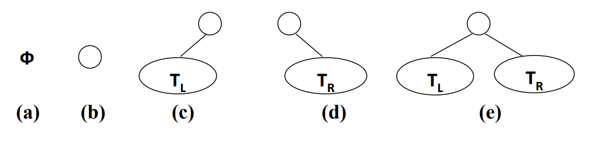
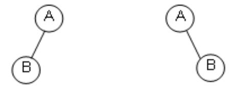

## 3.2.1二叉树的定义及性质
#### 二叉树的定义
**二叉树`T`**:一个有穷的结点集合
* 这个结点可以为空
* 若不为空，则它是由**根结点**和称为其**左子树** $T_L$和**右子树** $T_R$的两个不相交的二叉树组成

二叉树具体五种基本形态


二叉树的**子树有左右顺序之分**

#### 特殊二叉树
1. 斜二叉树(Skewed Binary Tree)
2. 完美二叉树(Perfect Binary Tree)
3. 完全二叉树(Complete Binary Tree)

#### 二叉树的几个重要性质
1. 一个二叉树第 $i$层的最大结点数为 $2^{i-1},i\geq1$
2. 深度为 $k$的二叉树有最大结点总数为： $2^k-1,k\geq1$
3. 对于任意的非空二叉树`T`，都有 $n_0=n_2+1$，其中 $n_0$代表叶结点的总数， $n_2$代表度为2的非叶结点总数

$$n_0+n_1+n_2-1=0\cdot n_0+1\cdot n_1+2\cdot n_2$$
#### 二叉树的抽象类型定义
**类型名称**：二叉树

**数据对象集**：一个有穷的结点集合

若不为空，则由**根结点和其左右子二叉树**组成

操作集： $BT\in BinTree$， $item\in ElementType$
1. `Boolean IsEmpty(BinTree BT)`：判别BT是否为空
2. `void Tranversal(BinTree BT)`：遍历，按照某一顺序访问每个结点
3. `BinTree CreatBinTree()`：创建一个二叉树

常用的遍历方法有
1. `void PreOrderTraversal(BinTree BT)`：先序，根，左子树，右子树
2. `void InOrderTraversal(BinTree BT)`：中序，左子树，根，右子树
3. `void PostOrderTraversal(BinTree BT)`：后序，左子树，右子树，根
4. `void LevelOrderTraversal(BinTree BT)`：层次遍历，从上到下，从左到右

结论推广

$n_0=1+各级结点数\cdot 级别$
## 3.2.2二叉树的存储结构
1. **顺序**存储结构
	*  **完全二叉树**：从上到下从左到右地顺序存储 $n$个结点的完全二叉树的**结点父子关系**
		* 非根结点的父结点的序号为 $[i/2]$
		* 结点的左孩子结点的序号为 $2i$
		* 结点的右孩子结点的序号为 $2i+1$ 
	* 一般二叉树也可以用这种方法做，但是会导致空间的浪费
2. 链表存储
```C
typedef struct TreeNode *BinTree;
typedef BinTree Position;
struct TreeNode
{
	ElementType Data;
	BinTree Left;
	BinTree Right;
}
```
