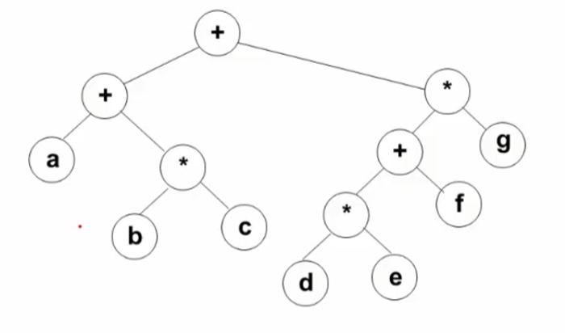
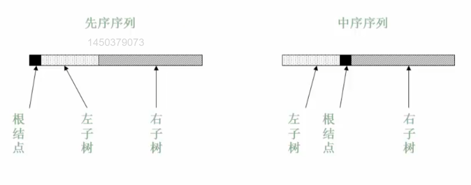

## 3.3.1先序后序中序遍历
（1）先序遍历

遍历过程为：
1. 访问根结点
2. 先序遍历其左子树
3. 先序遍历其右子树
```C
void PreOrderTraversal(BinTree BT)
{
    if(BT)
    {
        printf("%d",BT->Data);  /* 先序遍历根结点 */
        PreOrderTraversal(BT->Left);
        PreOrderTraversal(BT->Right);
    }
}
```
（2）中序遍历

遍历过程为：
1. 中序遍历其左子树
2. 访问根结点
3. 中序遍历其右子树
```C
void PreOrderTraversal(BinTree BT)
{
    if(BT)
    {
        PreOrderTraversal(BT->Left);
        printf("%d",BT->Data);  /* 先序遍历根结点 */
        PreOrderTraversal(BT->Right);
    }
}
```
（3）后序遍历

遍历过程为：
1. 后序遍历其左子树
2. 后序遍历其右子树
3. 访问根结点
```C
void PreOrderTraversal(BinTree BT)
{
    if(BT)
    {
        PreOrderTraversal(BT->Left);
        PreOrderTraversal(BT->Right);
        printf("%d",BT->Data);  /* 先序遍历根结点 */
    }
}
```
先序、中序和后序遍历过程：遍历过程中经过结点的路线一样，只是访问结点的时机不同
## 3.3.2中序非递归遍历
中序遍历非递归算法

非递归遍历算法基本思路：**使用堆栈**
1. 遇到一个结点，就把他压栈，并去遍历它的左子树
2. 当左子树遍历结束后，从栈顶弹出这个结点并访问它
3. 然后按其右指针再去中序遍历该结点的右子树
```C
void InOrderTraversal(BinTree BT)
{
	BinTree T=BT;
	Stack S=CreateStack(MaxSize);  /* 创建并初始化堆栈S */
	while(T||!IsEmpty(S))
	{
		while(T)  /* 一直向左，并将沿途结点压入堆栈 */
		{
			Push(S,T);
			T=T->Left;
		}
		if(!IsEmpty(S))
		{
			T=Pop(S);  /* 结点弹出堆栈 */
			printf("%5d",T->Data);  /* 访问结点 */
			T=T->Right;  /* 转向右子树 */
		}
	}
}
```
先序遍历也能非递归实现吗？

先序中序后序的实现，就是看在第几次遇到的时候进行打印

非递归的后序遍历实现

**方法一**：使用两个堆栈。

- 第一个堆栈用于遍历树，第二个堆栈用于存储后序遍历的结点。
- 访问顺序为根-右-左，然后将第二个堆栈的内容输出。

**方法二**：使用一个堆栈和一个指针。

- 堆栈用于遍历树，指针用于跟踪最后访问的结点。
- 通过检查右子结点是否已访问，确保按照后序遍历的顺序访问结点。

## 3.3.3层序遍历
二叉树遍历的核心问题：**二维结构的线性化**
* 从结点访问其左右儿子结点
* 访问左儿子后，右儿子结点怎么办
	* 需要一个存储结构保存暂时不访问的结点
	* 存储结构：堆栈、队列

队列实现：遍历从根结点开始，首先将根结点入队，然后执行循环：结点出队、访问该结点、其左右儿子入队

**层序基本过程**：先根结点入队，然后
1. 从队列中取出一个元素
2. 访问该元素所指的结点
3. 若该元素所指结点的左右孩子结点非空，则将其左右孩子的指针顺序入队

```C
void LevelOrderTraversal(BinTree BT)
{
	Queue Q;
	BinTree BT;
	if(!BT)
	{
		return;
	}
	Q=CreateQueue(MaxSize)
	AddQ(Q,BT);
	while(!IsEmptyQ(Q))
	{
		T=DleteQ(Q);
		printf("%d\n",T->Data);
		if(T->Left)
		{
			AddQ(Q,T->Left);
		}
		if(T->Right)
		{
			AddQ(Q,T->Right);
		}
	}
}
```
## 3.3.4遍历应用的例子
>例：遍历二叉树的应用：输出二叉树中的叶子结点

>在二叉树的遍历算法中增加检测几点的**左右子树是否都为空**
```C
void PreOrderPrintLeaves(BinTree BT)
{
    if(BT)
    {
        if(!BT->Left&&!BT->Right)
        {
            printf("%d",BT->Data);
        }
        PreOrderPrintLeaves(BT->Left);
        PreOrderPrintLeaves(BT->Right);
    }
}
```
>例：求二叉树的高度
```C
int PostOrderGetHeight(BinTree BT)
{
    int HL,HR,MaxH;
    if(BT)
    {
        HL=PostOrderGetHeight(BT->Left);
        HR=PostOrderGetHeight(BT->Right);
        MaxH=(HL>HR)?HL:HR;
        return (MaxH+);
    }
    else return 0;
}
```
>例：二元运算表达式树及其遍历

三种遍历可以得到三种不同的访问结果
1. 先序遍历得到前缀表达式： $++a\*bc\*+\*defg$
2. 中序遍历得到中缀表达式： $a+b\*c+d\*e+f\*g$，但是这个中缀表达式是不准的，中缀表达式会收到运算符优先级的影响
3. 后序遍历得到后缀表达式： $abc\*+de\*f+g\*+$

>例：由两种遍历序列确定二叉树
>已知三种遍历中的任意两种遍历序列，能否唯一确定一颗二叉树？

>其中有一种是中序即可，否则不行

#### 先序和中序遍历来确定一颗二叉树
>分析
* 根据先序遍历第一个结点确定根结点
* 根据根结点在中序遍历序列中分割左右两个子序列
* 对左子树和右子树分别递归使用相同方法继续分解


类似地，后序和中序遍历也可以确定一颗二叉树