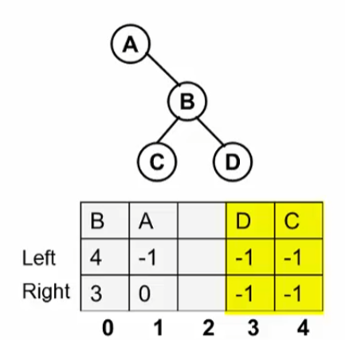

## 1.题意理解及二叉树表示
>给定两棵树 $T1$和 $T2$。如果 $T1$可以通过若干次左右孩子互换就变成 $T2$，则我们称两棵树是同构的

>现给定两棵树，请判断是否是同构的

输入格式：输入给出两颗二叉树的信息
* 先在一行中给出该树的结点数，随后 $N$行
* 第 $i$行对应编号第 $i$个结点，给出该结点中存储的字母、其左孩子结点的编号、右孩子结点的编号
* 如果孩子结点为空，则在相应位置上给出`-`

1. 二叉树表示
2. 建二叉树
3. 同构判别

#### 二叉树的表示
结构数组表示二叉树：静态链表
```C
#define MaxTree 10
#define ElementType char
#define Tree int
#define Null -1
struct TreeNode
{
    ElementType Element;
    Tree Left;
    Tree Right;
}T1[MaxTree],T2[MaxTree];
```

具有链表的灵活性，但是又存储在数组上，这种称为静态链表
## 2.程序框架、建树及同构判别
1. 读数据建二叉树
2. 二叉树同构判别

```C
#define MaxTree 10
#define ElementType char
#define Tree int
#define Null -1
struct TreeNode
{
    ElementType Element;
    Tree Left;
    Tree Right;
}T1[MaxTree],T2[MaxTree];

Tree BuildTree(struct TreeNode T[])
{
    scanf("%d\n",&N);
    if(N)
    {
        for(i=0;i<N;i++)
        {
            check[i]=0;
        }
        for(i=0;i<N;i++)
        {
            scanf("%c "%c "%c\n",&T[i].Element,&cl,&cr);
            if(cl!='-')
            {
                T[i].Left=cl-'0';
                check[T[i].Left]=1;
            }
            else
            {
                T[i].Left=Null;
            }
            if(cr!='-')
            {
                T[i].Right=cr-'0';
                check[T[i].Right]=1;
            }
            else
            {
                T[i].Right=Null;
            }
        }
        for(i=0;i<N;i++)
        {
            if(!check[i])
            {
                break;
            }
        }
        Root=i;
    }
    return Root;
}

int Isomorphic(Tree R1,Tree R2)
{
    if((R1==Null)&&(R2==Null))
    {
        return 1;
    }
    if((R1==Null)&&(R2!=Null)||(R1!=Null)&&(R2==Null))
    {
        return 0;
    }
    if(T1[R1].Element!=T[2].Element)
    {
        return 0;
    }
    if((T1[R1].Left==Null)&&(T2[R2].Left==Null))
    {
        return Isomorphic(T1[R1].Right,T2[R2].Right);
    }
    if((T1[R1].Left!=Null)&&(T2[R2].Left!=Null)&&
        (T1[T1[R1].Left].Element)==(T2[T2[R2].Left].Element))
    {
        return (Isomorphic(T1[R1].Left,T2[R2].Left)&&
                Isomorphic(T1[R1].Right,T2[R2].Right));
    }
    else
    {
        return (Isomorphic(T1[R1].Left,T2[R2].Right)&&
                Isomorphic(T1[R1].Right,T2[R2].Left));
    }
}

int main()
{
    Tree R1,R2;
    R1=BuildTree(T1);
    R2=BuildTree(T2);
    if(Isomorphic(R1,R2))
    {
        printf("Yes\n");
    }
    else
    {
        printf("No\n");
    }
    return 0;
}
```