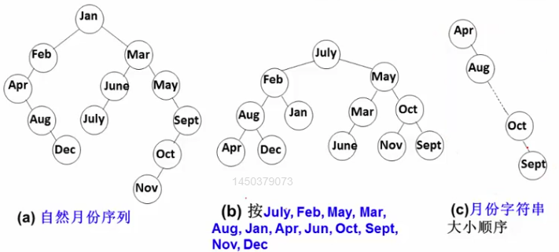
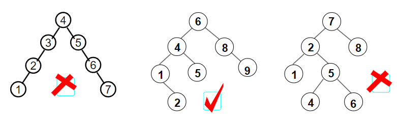
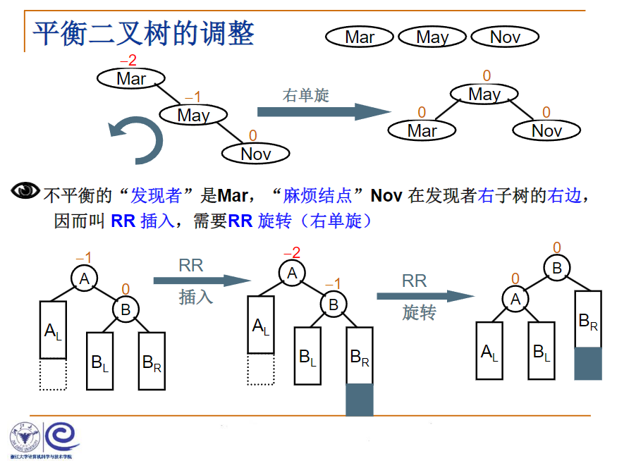
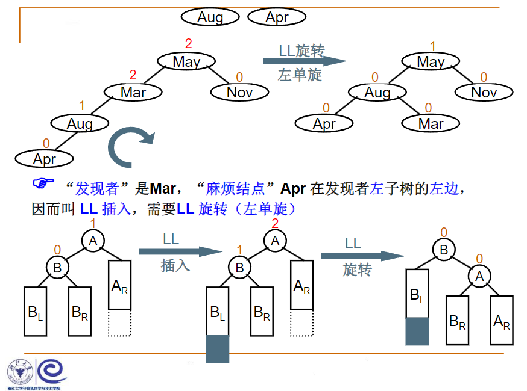
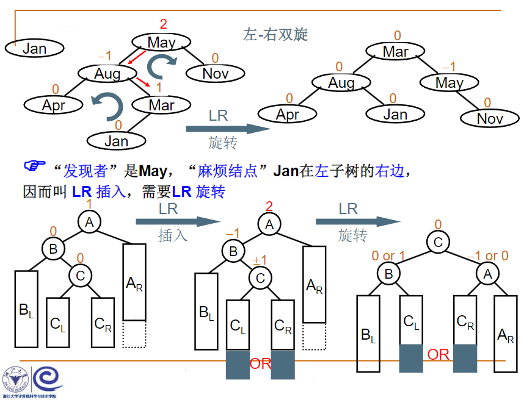
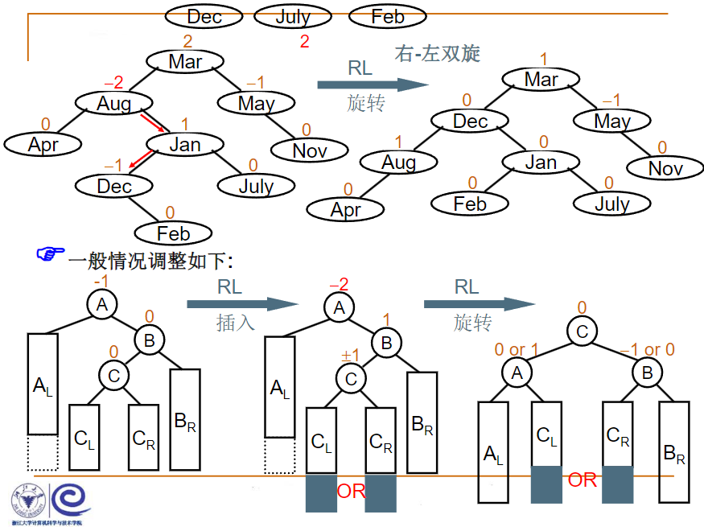

## 4.2.1什么是平衡二叉树
例：搜索树结点不同插入次序，将导致不同的**深度**和平均查找长度**ASL**

1. $ASL(a)=3.5$
2. $ASL(a)=3.0$
3. $ASL(a)=6.5$

**平衡因子**（ $Balance Factor$，简称 $BF$）： $BF(T)=h_L-h_R$，其中 $h_L$和 $h_R$分别为 $T$的左右子树高度

**平衡二叉树**（ $Balance Binary Tree$）( $AVL$树)
1. 空树
2. 任一结点左右子树高度差的绝对值不超过1，即 $|BF(T)\leq1|$


#### 平衡二叉树的高度能达到 $log_2n$吗？
设 $n_h$是高度为 $h$的平衡二叉树的最少结点数，结点最少时：
$$n_h=n_{h-1}+n_{h-2}+1$$


$$n_h=F_{h+2}-1$$

$$\Rightarrow F_i=\frac{1}{\sqrt5}(\frac{1+\sqrt5}{2})^i$$

$$\Rightarrow n_h=\frac{1}{\sqrt5}(\frac{1+\sqrt5}{2})^{h+2}-1$$

$$\Rightarrow h=O(log_2n)$$

给定结点数为 $n$的 $AVL$树，最大高度为  $O(log_2n)$
## 平衡二叉树的调整




```C
typedef struct AVLNode *Position;
typedef Position AVLTree; /* AVL树类型 */
struct AVLNode{
    ElementType Data; /* 结点数据 */
    AVLTree Left;     /* 指向左子树 */
    AVLTree Right;    /* 指向右子树 */
    int Height;       /* 树高 */
};

int Max ( int a, int b )
{
    return a > b ? a : b;
}

AVLTree SingleLeftRotation ( AVLTree A )
{ /* 注意：A必须有一个左子结点B */
  /* 将A与B做左单旋，更新A与B的高度，返回新的根结点B */     

    AVLTree B = A->Left;
    A->Left = B->Right;
    B->Right = A;
    A->Height = Max( GetHeight(A->Left), GetHeight(A->Right) ) + 1;
    B->Height = Max( GetHeight(B->Left), A->Height ) + 1;
 
    return B;
}

AVLTree DoubleLeftRightRotation ( AVLTree A )
{ /* 注意：A必须有一个左子结点B，且B必须有一个右子结点C */
  /* 将A、B与C做两次单旋，返回新的根结点C */
    
    /* 将B与C做右单旋，C被返回 */
    A->Left = SingleRightRotation(A->Left);
    /* 将A与C做左单旋，C被返回 */
    return SingleLeftRotation(A);
}

/*************************************/
/* 对称的右单旋与右-左双旋请自己实现 */
/*************************************/

AVLTree Insert( AVLTree T, ElementType X )
{ /* 将X插入AVL树T中，并且返回调整后的AVL树 */
    if ( !T ) { /* 若插入空树，则新建包含一个结点的树 */
        T = (AVLTree)malloc(sizeof(struct AVLNode));
        T->Data = X;
        T->Height = 0;
        T->Left = T->Right = NULL;
    } /* if (插入空树) 结束 */

    else if ( X < T->Data ) {
        /* 插入T的左子树 */
        T->Left = Insert( T->Left, X);
        /* 如果需要左旋 */
        if ( GetHeight(T->Left)-GetHeight(T->Right) == 2 )
            if ( X < T->Left->Data ) 
               T = SingleLeftRotation(T);      /* 左单旋 */
            else 
               T = DoubleLeftRightRotation(T); /* 左-右双旋 */
    } /* else if (插入左子树) 结束 */
    
    else if ( X > T->Data ) {
        /* 插入T的右子树 */
        T->Right = Insert( T->Right, X );
        /* 如果需要右旋 */
        if ( GetHeight(T->Left)-GetHeight(T->Right) == -2 )
            if ( X > T->Right->Data ) 
               T = SingleRightRotation(T);     /* 右单旋 */
            else 
               T = DoubleRightLeftRotation(T); /* 右-左双旋 */
    } /* else if (插入右子树) 结束 */

    /* else X == T->Data，无须插入 */

    /* 别忘了更新树高 */
    T->Height = Max( GetHeight(T->Left), GetHeight(T->Right) ) + 1;
    
    return T;
}
```
