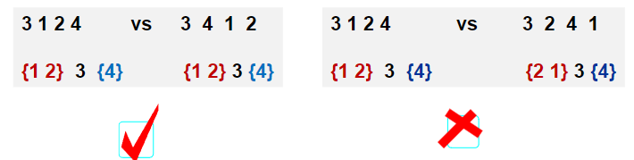

## 1.题意理解及搜索树表示
>给定一个插入序列就可以唯一确定一颗二叉搜索树，然而，一颗给定的二叉搜索树却可以由多种不同的插入序列得到
* 例如，按照 $\{2,1,3\}$和 $\{2,3,1\}$插入初始为空的二叉搜索树，都得到一样的结果

>问题：对于输入的各种插入序列，你需要判断它们是否能生成一样的二叉搜索树

#### 求解思路
两个序列是否对应相同搜索树的判别
1. 分别建两颗搜索树的判别方法
	1. 根据两个序列分别建树，再判别树是否一样
2. 不建树的判别方法
3. 建一棵树，再判别其他序列是否与该树一致

1. 搜索树表示
2. 建搜索树 $T$
3. 判别一序列是否与搜索树 $T$一致
```C
typedef struct TreeNode *Tree;
struct TreeNode
{
    int v;
    Tree Left,Right;
    int flag;
};
```
## 2.程序框架及建树
需要设计的主要函数：
1. 读数据建搜索树 $T$
2. 判别一序列是否与 $T$构成一样的搜索树
```C
typedef struct TreeNode *Tree;
struct TreeNode
{
    int v;
    Tree Left,Right;
    int flag;
};

Tree MakeTree(int N)
{
    Tree T;
    int i,V;

    scanf("%d",&V);
    T=NewNode(V);
    for(i=1;i<N;i++)
    {
        scanf("%d",&V);
        T=Insert(T,V);
    }
    return T;
}

Tree NewNode(int V)
{
    Tree T=(Tree)malloc(sizeof(struct TreeNode));
    T->v=V;
    T->Left=T->Right=NULL;
    T->flage=0;
    return T;
}

Tree Insert(Tree T,int V)
{
    if(!T)
        T=NewNode(V);
    else
    {
        if(V>T->v)
            T->Right=Insert(T->Right,V);
        else
            T->Left=Insert(T->Left,V);
    }
    return T;
}

int main()
{
    int N,L,i;
    
    scanf("%d",&N);
    while(N)
    {
        scanf("%d",&L);
        T=MakeTree(N);
        for(i=0;i<L;i++)
        {
            if(Judge(T,N))
                printf("Yes\n");
            else
                printf("No\n");
            ResetT(T);  /* delete flag in T */
        }
        FreeTree(T);
        scanf("%d",&N);
    }
    return 0;
}
```
## 3.搜索树是否一样的判别
如何判断序列是否与树一致

方法：在树种按顺序搜索序列种的每个数
* 如果每次搜索所经过的结点在前面均出现过，则一致
* 否则（某次搜索中遇到前面未出现的结点），则不一致

```C
#include <stdio.h>  
#include <stdlib.h>  

typedef struct TreeNode *Tree;  
struct TreeNode   
{  
    int v;  
    Tree Left, Right;  
    int flag;  
};  

Tree NewNode(int V)   
{  
    Tree T=(Tree)malloc(sizeof(struct TreeNode));  
    if (T==NULL)   
    {  
        fprintf(stderr, "Memory allocation failed\n");  
        exit(EXIT_FAILURE);  
    }  
    T->v=V;  
    T->Left=T->Right=NULL;  
    T->flag=0;  
    return T;  
}  

Tree Insert(Tree T,int V)   
{  
    if (!T)   
    {  
        return NewNode(V);  
    }   
    else   
    {  
        if (V>T->v)   
        {  
            T->Right=Insert(T->Right,V);  
        }   
        else   
        {  
            T->Left=Insert(T->Left,V);  
        }  
    }  
    return T;  
}  

Tree MakeTree(int N)   
{  
    Tree T=NULL;  
    int V;  

    for (int i=0;i<N;i++)   
    {  
        scanf("%d", &V);  
        T=Insert(T, V);  
    }  
    return T;  
}  

int check(Tree T,int V)   
{  
    if (T==NULL)   
    {  
        return 0; // Value not found  
    }  
    if (T->flag)   
    {  
        if (V<T->v)   
        {  
            return check(T->Left,V);  
        }   
        else if (V>T->v)   
        {  
            return check(T->Right,V);  
        }   
        else   
        {  
            return 0; // Value already checked  
        }  
    }   
    else   
    {  
        if (V==T->v)   
        {  
            T->flag=1;  
            return 1; // Value found  
        }   
        else   
        {  
            return 0; // Value not found  
        }  
    }  
}  

int Judge(Tree T,int N)   
{  
    int V,flag=0;  

    scanf("%d",&V);  
    if (V!=T->v)   
    {  
        flag=1;  
    }   
    else   
    {  
        T->flag=1;  
    }  
    for (int i=1;i<N;i++)   
    {  
        scanf("%d",&V);  
        if ((!flag)&&(!check(T, V)))   
        {  
            flag=1;  
        }  
    }  
    return flag?0:1;  
}  

void ResetT(Tree T)   
{  
    if (T)   
    {  
        T->flag=0;  
        ResetT(T->Left);  
        ResetT(T->Right);  
    }  
}  

void FreeTree(Tree T)   
{  
    if (T)   
    {  
        FreeTree(T->Left);  
        FreeTree(T->Right);  
        free(T);  
    }  
}  

int main()   
{  
    int N,L;  

    scanf("%d",&N);  
    while (N)   
    {  
        scanf("%d",&L);  
        Tree T=MakeTree(N);  
        for (int i=0;i < L;i++)   
        {  
            if (Judge(T,N))   
            {  
                printf("Yes\n");  
            }   
            else   
            {  
                printf("No\n");  
            }  
            ResetT(T);  // Reset flags in T  
        }  
        FreeTree(T);  
        scanf("%d",&N);  
    }  
    return 0;  
}  
```