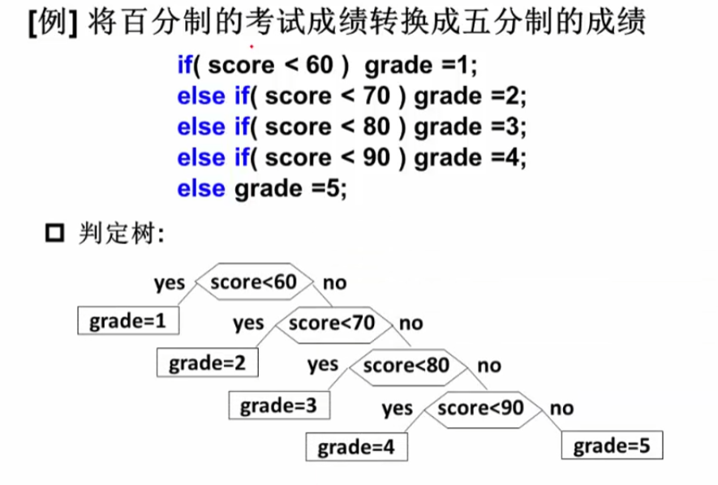

## 5.2.1什么是哈夫曼树
>例：将百分制的考试成绩转换成五分制的成绩

对应的判定树

**如何根据结点不同的查找频率构造更有效的搜索树？**
#### 哈夫曼树的定义
**带权路径长度**（ $WPL$）：设二叉树有 $n$叶子结点，每个叶子节点带有权值 $W_k$，从根结点到每个叶子结点的长度为 $l_k$，则每个叶子结点的带权路径长度之和为： 

$$WPL=\sum_{i=0}^nw_kl_k$$

**最优二叉树**或**哈夫曼树**： $WPL$最小的二叉树
## 5.2.2哈夫曼树的构造
每次把权值最小的两颗二叉树合并
```C
typedef struct TreeNode *HuffmanTree;
struct TreeNode
{
    int Weight;
    HuffmanTree Left,Right;
};

HuffmanTree Huffman(MinHeap H)
{  /* 假设H->Size个权值已经存在H->Elements[]->Weight里 */
    int i;
    HuffmanTree T;
    BuildMinHeap(H);  /* 将H->Elements[]按权值调整为最小堆 */
    for(int i=1;i<H->Size;i++)  /* 做H->Size-1次合并 */
    {
        T=malloc(sizeof(struct TreeNode));  /* 建立新结点 */
        T->Left=DeleteMin(H);  /* 从最小堆中删除一个结点，作为新T的左子结点 */
        T->Right=DeleteMin(H);  /* 从最小堆中删除一个结点，作为新T的右子结点 */
        T->Weight=T->Left->Weight+T->Right->Weight;  /* 计算新权值 */
        Insert(H,T);  /* 将T插入最小堆 */
    }
    T=DeleteMin(H);
    return T;
}
```
$$O(NlogN)$$
#### 哈夫曼树的特点
1. 没有度为1的结点
2.  $n$个叶子结点的哈夫曼树共有 $2n-1$个结点
	1.  $n_2=n_0-1$
3. 哈夫曼树的任意非叶结点的左右子树交换后仍是哈夫曼树
4. 对同一组权值 ${w_1,w_2,\cdots,w_n}$，是否存在不同构的两颗哈夫曼树？
	1. 这是可能的，但是 $WPL$值是一样的，最优化的值是一样的
## 5.2.3哈夫曼编码
>给定一段字符串，如何对字符进行编码，可以使得该字符串的编码存储空间最少？

>例：假设有一段文本，包含58个字符，并由以下七个字符构成： $a,e,i,s,t,sp,nl$；这7个字符出现的次数不同，如何对这7个字符进行编码使得总编码空间最少？

1. 用等长的 $ASCII$编码： $58\times8=464$位
2. 用等长的三位编码： $58\times3=174$位
3. 不等长编码：出现频率高的字符用的编码短些，出现频率低的字符编码长些

#### 怎样进行不等长编码？
如何避免二义性

**前缀码**（ $prefix\ code$）：任何字符的编码都不是另一字符编码的前缀
* 可以无二义地解码

#### 二叉树用于编码
用二叉树进行编码
1. 左右分支：0，1
2. 字符只在叶结点上

怎么构造一棵编码代价最小的二叉树？

就是哈夫曼树

最小代价且不会出现二义性

>为什么 $00,100,101,110,111$不是哈夫曼编码？

>其实它并不违反前缀码的法则，但是回想一下哈夫曼编码的过程，两个最小的为左右子树，结点为最小的两个的和，不断递归到根结点，因此哈夫曼树的所有节点的度为 $0$或 $2$。这个例子中有一个结点的度为 $1$，故不是哈夫曼编码