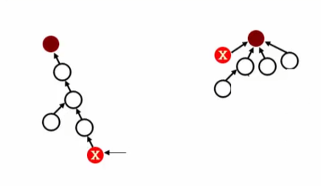
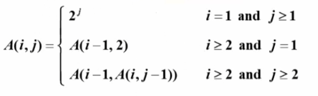

## 集合的简化表示
```C
typedef int ElementType;  /* 默认元素可以 用非负整数表示 */
typedef int SetName;  /* 默认用根结点的下标作为集合名称 */
typedef ElementType SetType[MaxSize];

SetName Find(SetType S,ElementType X)
{  /* 默认集合元素全部初始化为1 */
    for( ;S[X]>0;X=S[X]) ;
    return X;
}

void Union(SetType S,SetName Root1,SetName Root2)
{  /* 这里默认Root1和Root2是不同集合的根结点 */
    S[Root2]=Root1;
}
```
## 题意理解与TSSN的实现
```C
#define MaxSize 1000
typedef int ElementType;  /* 默认元素可以 用非负整数表示 */
typedef int SetName;  /* 默认用根结点的下标作为集合名称 */
typedef ElementType SetType[MaxSize];

SetName Find(SetType S,ElementType X)
{  /* 默认集合元素全部初始化为1 */
    for( ;S[X]>0;X=S[X]) ;
    return X;
}

void Union(SetType S,SetName Root1,SetName Root2)
{  /* 这里默认Root1和Root2是不同集合的根结点 */
    S[Root2]=Root1;
}

void Initialization(S,n)

void Input_connection(SetType S)
{
    ElementType u,v;
    SetName Root1,Root2;
    scanf("%d %d\n",&u,&v);
    Root1=Find(S,u-1);
    Root2=Find(S,v-1);
    if(Root1!=Root2)
        Union(S,Root1,Root2);
}

void Check_connection(SetType S)
{
    ElementType u,v;
    SetName Root1,Root2;
    scanf("%d %d\n",&u,&v);
    Root1=Find(S,u-1);
    Root2=Find(S,v-1);
    if(Root1==Root2)
        printf("yes\n");
    else
        printf("no\n");
}

void Check_network(SetType S,int n)
{
    int i,counter=0;
    for(i=0;i<n;i++)
    {
        if(S[i]<0)
            counter++;
    }
    if(counter==1)
        printf("The network is connected.\n");
    else
        printf("There are %d components.\n",counter);
}

int main()
{
    SetType S;
    int n;
    char in;
    scanf("%d\n",&n);
    Initialization(S,n);
    do
    {
        scanf("%c",&in);
        switch (in)
        {
        case 'I':
            Input_connection(S);
            break;
        case 'C':
            Check_connection(S);
            break;
        case 'S':
            Check_network(S,n);
            break;
        default:
            break;
        }
    } while (in!='S');
    return 0;
}
```
## 按秩归并
```C
#define MaxSize 1000
typedef int ElementType;  /* 默认元素可以 用非负整数表示 */
typedef int SetName;  /* 默认用根结点的下标作为集合名称 */
typedef ElementType SetType[MaxSize];

SetName Find(SetType S,ElementType X)
{  /* 默认集合元素全部初始化为1 */
    for( ;S[X]>0;X=S[X]) ;
    return X;
}

void Union(SetType S,SetName Root1,SetName Root2)
{  /* 这里默认Root1和Root2是不同集合的根结点 */
    //S[Root2]=Root1;
    if(S[Root2]<S[Root1])
    {
        S[Root2]+=S[Root1];
        S[Root1]=Root2;
    }
    else
    {
        S[Root1]+=S[Root2];
        S[Root2]=Root1;
    }
    /* 
    if(S[Root2]<S[Root1])
        S[Root1]=Root2;
    else
    {
        if(S[Root1]==S[Root2])
            S[Root1]--;
        S[Root2]=Root1;
    }
     */
}

void Initialization(S,n)

void Input_connection(SetType S)
{
    ElementType u,v;
    SetName Root1,Root2;
    scanf("%d %d\n",&u,&v);
    Root1=Find(S,u-1);
    Root2=Find(S,v-1);
    if(Root1!=Root2)
        Union(S,Root1,Root2);
}

void Check_connection(SetType S)
{
    ElementType u,v;
    SetName Root1,Root2;
    scanf("%d %d\n",&u,&v);
    Root1=Find(S,u-1);
    Root2=Find(S,v-1);
    if(Root1==Root2)
        printf("yes\n");
    else
        printf("no\n");
}

void Check_network(SetType S,int n)
{
    int i,counter=0;
    for(i=0;i<n;i++)
    {
        if(S[i]<0)
            counter++;
    }
    if(counter==1)
        printf("The network is connected.\n");
    else
        printf("There are %d components.\n",counter);
}

int main()
{
    SetType S;
    int n;
    char in;
    scanf("%d\n",&n);
    Initialization(S,n);
    do
    {
        scanf("%c",&in);
        switch (in)
        {
        case 'I':
            Input_connection(S);
            break;
        case 'C':
            Check_connection(S);
            break;
        case 'S':
            Check_network(S,n);
            break;
        default:
            break;
        }
    } while (in!='S');
    return 0;
}
```
## 路径压缩

递归函数容易爆栈

>但是尾递归可以非常容易地转化成循环，编译器自己就会帮你转化成优化后的循环操作，所以这里不需要担心爆栈

>尾递归每调用一个函数就执行完，而传统递归是嵌套式，要抵达最深再返回

引理：令 $T(M,N)$为交错执行 $M\geq N$次带路径压缩的查找和 $N-1$次按秩归并的最坏情况时间。则存在正常数 $k_1$和 $k_2$使得：

$$k_1M\alpha(M,N)\leq T(M,N)\leq k_2M\alpha(M,N) $$
$Ackermann$函数和 $\alpha(M,N)$

$\alpha(M,N)=min\{i\geq 1|A(i,[M/N])>logN\}\leq O(log^*N)\leq4$

$log^*N$（ $Ackermann$反函数）=对 $N$求对数直到结果 $\leq 1$的次数