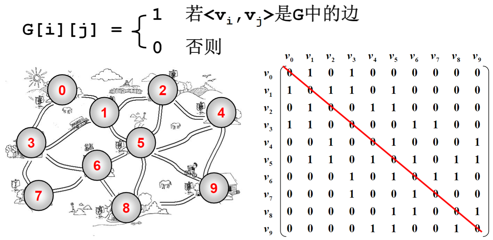

## 6.1.1什么是图
表示多对多的关系
包含
1. 一组顶点：通常用 $V（Vertex）$表示顶点集合
2. 一组边：通常用 $E（Edge）$表示边的集合
	1. 边是顶点对： $(v,w)\in E$，其中 $v,w\in V$
	2. 有向边 $<v,w>$表示从 $v$指向 $w$的边（单行线）
	3. 不考虑重边和自回路

#### 抽象数据类型定义
**类型名称**：图（ $Graph$）

**数据对象集**： $G(V,E)$由一个非空的有限顶点集合 $V$和一个有限边集合 $E$组成

**操作集**：对于任意图 $G\in Graph$，以及 $v\in V,e\in E$
1. `Graph Create()`：建立并返回空图；
2. `Graph InsertVertex(Graph G,Vertex v)`：将 $v$插入 $G$；
3. `Graph InsertEdge(Graph G,Edge e)`：将 $e$插入 $G$；
4. `void DFS(Graph G,Vertex v)`：从顶点 $v$出发深度优先遍历图 $G$；
5. `void BFS(Graph G,Vertex v)`：从顶点 $v$出发宽度优先遍历图 $G$；
6. `void ShorttestPath(Graph G,Vertex v,int Dist[])`：计算图 $G$中顶点 $v$到任意其他顶点的最短距离；
7. `void MST(Graph G)`：计算图 $G$的最小生成树；

#### 常见术语
1. 无向图
2. 有向图
3. 网络

## 什么是图-邻接矩阵表示法
* 邻接矩阵 $G[N][N]$-- $N$个顶点从 $0$到 $N-1$编号

#### 怎样在程序中表示一个图
邻接矩阵
* 问题：对于无向图的存储，怎样可以省一半的空间
* 答案：只存下三角或者上三角

$G_{ij}$对应的下标为 $(i*(i+1)/2+j)$

对于网络，把 $G[i][j]$的值定义为权重

好处？
1. 直观好理解
2. 方便检查任意一对顶点之间是否存在边
3. 方便找任一顶点的所有“邻接点”（有边直接相连的顶点）
4. 方便计算任一顶点的“度”（从该点发出的边数为“出度”，指向该点的边数为“入度”）
	1. 无向图：对应行或者列非零元素的个数
	2. 有向图：对应行非零元素的个数是“出度”；对应列非零元素的个数是“入度”

坏处
1. 浪费空间：存稀疏矩阵时
	1. 对于稠密图（特别是完全图，即全为1）还是很合算的
2. 浪费时间：统计稀疏图中有多少条边
## 6.1.3什么是图-邻接表表示法
邻接表： $G[N]$为指针数组，对应矩阵每行一个链表，只存非零元素

对于网络，结构中要增加权重的域

足够稀疏才合算

好处
1. 方便找任一顶点的所有邻接点
2. 节约稀疏图的空间
	1. 需要 $N$个头指针和 $2E$个结点（每个结点至少两个域）
3. 方便计算任一顶点的度？
	1. 对于无向图：是的
	2. 对于有向图：只能计算出度；需要构造逆邻接表（存指向自己的边）来方便计算入度
4. 方便检查任意一对顶点之间是否存在边？
	1. 不方便

>十字链表：用链表表示图并且能方便地得到有向图的出入度