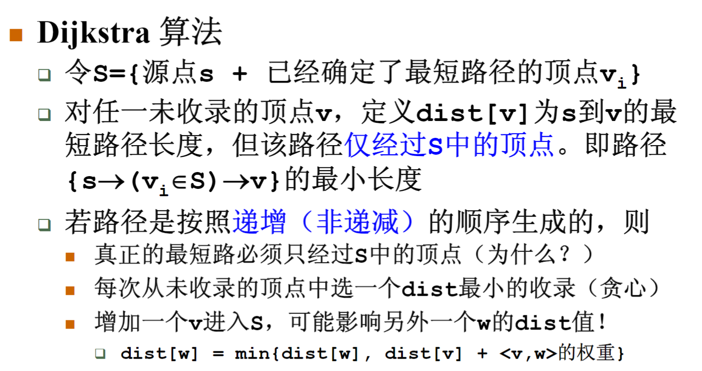

## 7.1.1概述
权值和最小的路径：最短路径
1. 第一个顶点称为：源点
2. 最后一个顶点称为终点

单源最短路径问题：从某个固定源点出发，到其他任意顶点的最短路径
1. 有向无权图
2. 有向有权图

多源最短路径问题：求任意两顶点间的最短路径
## 7.1.2无权图的单源最短路
无权图的单源最短路径算法

按照非递减的顺序找出到各个顶点的最短路径

$BFS$广度优先搜索

用一个数组`dist[]`记录各个顶点到源点的距离，初值均设为-1，访问到的时候给距离数组赋值，更改数组的值，代表已经访问过了

用另外一个数组`path[]`记录`S`到`W`的路上经过的某顶点，借助一下堆栈，可以记录源点到某顶点的路径

时间复杂度： $T=O(V+E)$
## 7.1.2-s无权图的单源最短路示例
```C
void Unweighted(Vertex S)
{
	Enqueue(S,Q);
	while(!IsEmpty(Q))
	{
		V=Dequeue(Q);
		for(V的每个邻接点W)
		{
			if(dist[W]==-1)
			{
				dist[W]=dist[V]+1;
				path[W]=V;
				Enqueue(W,Q);
			}
		}
	}
}
```
## 7.1.3有权图的单源最短路


这里`dist[]`的初始值一定要定义为正无穷，这样才能在算法中更新更小值

```C
void Dijkstra(Vertex s)
{
    while(1)
    {
        V=未收录顶点中dist最小者;
        if(这样的V不存在)
            break;
        collected[V]=true;
        for(V的每一个邻接点W)
        {
            if(collected[W]==false)
            {
                if(dist[V]+E_v-w<dist[W])
                {
                    dist[W]=dist[V]+E_v-w;
                    path[W]=V;
                }
            }
        }
    }
}
```
该算法不能解决有负边的情况

1. 直接扫描所有未收录顶点 $O(V)$
	1.  $T=O(V^2+E)$
	2. 对于稠密图效果好
2. 将`dist`存在最小堆中 $O(logV)$
	1. 更新`dist[w]`的值 $O(logV)$
	2.  $T=O(VlogV+ElogV)=O(ElogV)$
	3. 对于稀疏图效果好
## 7.1.3-s有权图的单源最短路示例
## 7.1.4多源最短路算法
稀疏图可以把单源的算法进行重复调用

$$T=(V^3+EV)$$

稠密图采用 $Floyd$算法（还要花时间搞一下，没太懂）

$$T=O(V^3)$$


