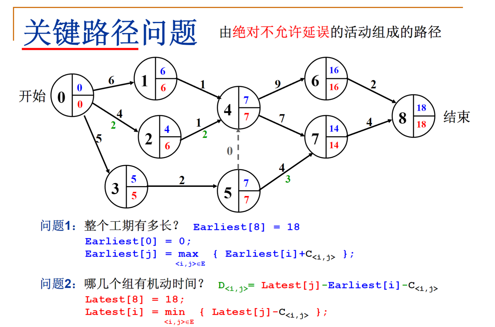

## 8.2.1拓扑排序
$AOV(Activity\ On\ Vertex)$网络

拓扑序：如果图中从V到W有一条有向路径，则V一定排在W之前。满足此条件的顶点序列称为一个拓扑序。

获得拓扑序的过程叫拓扑排序。

$AOV$如果有合理的拓扑序，则必定是有向无环图。$Directed\ Acyclic\ Graph,DAG$

 没有前驱结点的入度都为0

```C
void TopSort()
{
	for(cnt=0;cnt<V;cnt++)
	{
		V=未输出的入度为0的顶点;
		if(这样的V不存在)
		{
			ERROR("图中有回路");
			break;
		}
		输出V，或者记录V的输出序号;
		for(V的每一个邻接点W)
			Indegree[W]--;
	}
}
```
$T=O(V^2)$

#### 聪明的算法
随时将入度变为0的顶点放到一个容器里。
```C
void TopSort()
{
	for(图中的每个顶点V)
	{
		if(Indegree[V]==0)
		{
			Enqueue(V,Q);
		}
	}
	while(!IsEmpty(Q))
	{
		V=Dequeue(Q);
		输出V，或者记录V的输出序号;
		cnt++;
		for(V的每个邻接点W)
			if(--Indegree[W]==Q)
				Enqueue(W,Q);
	}
	if(cnt!=V)
		ERROR("图中有回路");
}
```
$T=O(V+E)$

此算法还可以用于检测是否为有向无环图
## 8.2.2关键路径
$AOE(Activity\ On\ Edge)$网络
1. 一般用于安排项目的工序

工期的推算应该找最大的那个



加快关键路径的完工速度，可以提高整个项目的完工速度

```C
/* 邻接表存储 - 拓扑排序算法 */

bool TopSort( LGraph Graph, Vertex TopOrder[] )
{ /* 对Graph进行拓扑排序,  TopOrder[]顺序存储排序后的顶点下标 */
    int Indegree[MaxVertexNum], cnt;
    Vertex V;
    PtrToAdjVNode W;
       Queue Q = CreateQueue( Graph->Nv );
 
    /* 初始化Indegree[] */
    for (V=0; V<Graph->Nv; V++)
        Indegree[V] = 0;
        
    /* 遍历图，得到Indegree[] */
    for (V=0; V<Graph->Nv; V++)
        for (W=Graph->G[V].FirstEdge; W; W=W->Next)
            Indegree[W->AdjV]++; /* 对有向边<V, W->AdjV>累计终点的入度 */
            
    /* 将所有入度为0的顶点入列 */
    for (V=0; V<Graph->Nv; V++)
        if ( Indegree[V]==0 )
            AddQ(Q, V);
            
    /* 下面进入拓扑排序 */ 
    cnt = 0; 
    while( !IsEmpty(Q) ){
        V = DeleteQ(Q); /* 弹出一个入度为0的顶点 */
        TopOrder[cnt++] = V; /* 将之存为结果序列的下一个元素 */
        /* 对V的每个邻接点W->AdjV */
        for ( W=Graph->G[V].FirstEdge; W; W=W->Next )
            if ( --Indegree[W->AdjV] == 0 )/* 若删除V使得W->AdjV入度为0 */
                AddQ(Q, W->AdjV); /* 则该顶点入列 */ 
    } /* while结束*/
    
    if ( cnt != Graph->Nv )
        return false; /* 说明图中有回路, 返回不成功标志 */ 
    else
        return true;
}
```